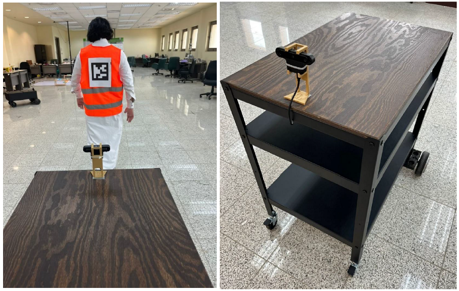

# Auto Follower-Cart
_____  

This project was developed as a senior design project by Electrical and Computer Engineering students at KAU, Jeddah, KSA in Fall 2021.  

## Introduction
_____  

This product is a follower robot, capable of transporting weights up to 100 Kg in closed environments like warehouses or even office environment.  
The robot functions in semi-autonomous mode, which requires an operator to be close by, and it will follow the operator (the user).
It can also be controlled via phone app, or in pushing mode by showing an Acuro marker to the camera, and the robot will start moving in
its direction.

## Algorithm
_____  
To implement this project, we use ArUco markers, as it provides us the means to do lightweight accurate pose estimation. 
This is necessary to enable the robot to detect and follow the user. 

simply, the camera will receive continues frames, and will send them to the ArUco detector code. Then, pose estimation
and other calculations are done to determine the position and orientation of the user. This information is then interpreted 
as [speed] and [steer] and will be sent to the motors controlling the wheels of the robot. 

## instructions
These operation instructions are to be used by the user of AutoCart:
<ol>
  <li>Put your items/loads in the AutoCart cargo space.</li>
  <li>Press the power button on the AutoCart</li>
    <ol>
      <li>Remote control mode:</li>
      <ol>
        <li>On your phone, connect to the network named “KAU_Office_Delivery_Robot”. Provide the password.</li>
        <li>After connecting, run the remote control software provided.</li>
        <li>Use the tools on screen to move the robot forward, backward, steer left and right, and see the feedback printed on screen including battery voltage.</li>
      </ol>
      <li>Following and pushing mode:</li>
      <ol>
        <li>Make sure the Aruco marker is clear on your back. </li>
        <li>Press the button that runs the Raspberry Pi, and wait for it to boot.</li>
        <li>After booting, the program will automatically run and you will hear a sound from the camera indicating that.</li>
        <li>Stand with your back facing the Camera. </li>
        <li>Start moving, and the robot will start following you. Keep an eye on the road and make sure that the robot is following you and that you are not out of its sight.</li>
        <li>To change to pushing mode, turn around such that the Aruco marker is hidden to the camera behind your back. Use the mode button to change to push mode. Then use the hand held Aruco marker in front of the camera, the robot will start moving backward like if you are pushing it.</li>
      </ol>
    </ol>
  <li>To stop the AutoCart in either mode, press the power button for the Raspberry Pi if it was on, and then the power button of the hoveboard.</li>
</ol>

## The code
____  
- OAKdLink.py:
  - Initialize the camera. For our case, we are using the openCV OAK-D cam. initialization done through oakd-init() and 
  set_oakd_props().
  - Initialize what's necessary for ArUco detection. This is done through aruco_init().
- TCPLink.py
  - Has code that starts a TCP connection to ESP module that is connected to the hoverboard.
  - Sends and receives commands to the ESP (which sends it to hoverboard)
- depth_video_v2.py
  - Has code responsible for depth information needed for obstacle detection
- Controller.py
  - Has code responsible for controlling the robot by calculating (speed) and (steer) variables
- main.py
  - Obtain camera frames, then detect ArUco marker.
  - Perform pose estimation.
  - Find the position of the user in real world using the information of pose estimation.
  - Use this information to control the robot to move forward, backward, left, or right.

## The phone app
The app is provided as AutoCart.slx file. This needs to be build using Simulink. Please refer to proper instructions
from the MATLAB documentation. 

## The Team
Al Fahd Felemban: 14720aa@gmail.com  
Ahmed Batwa: ahmed.i.patwa@gmail.com  
Amro Batwa: eng.batwa@gmail.com
